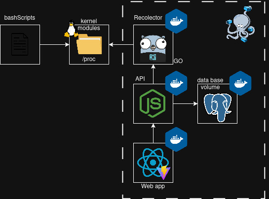
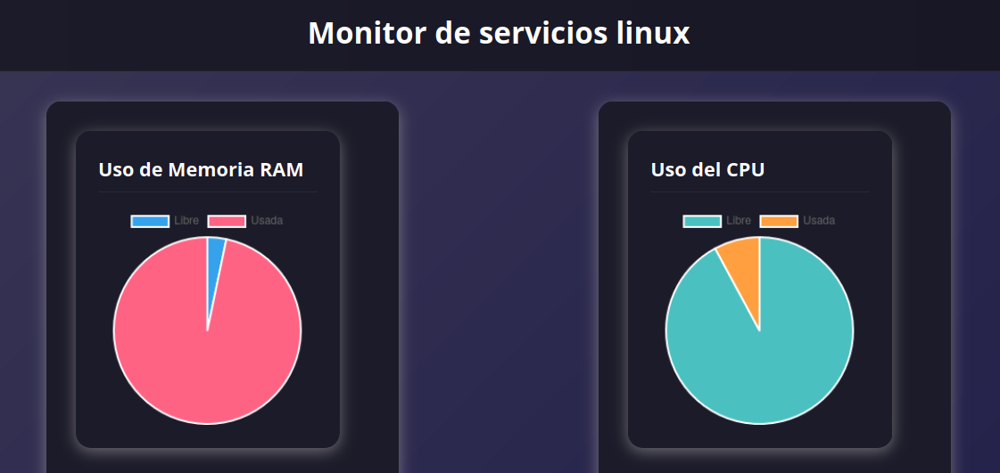
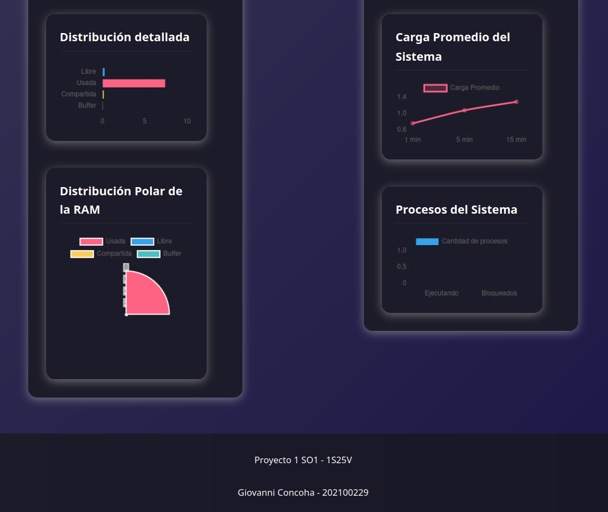

---

# sopes1\_1s25V

# Monitor de Servicios Linux

---

Este proyecto automatiza tareas del sistema con scripts, mientras un recolector en Go analiza dichas tareas y envía datos a una API en Node.js. La información se transmite a un frontend en React y se almacena en PostgreSQL, permitiendo gestión eficiente de contenedores en Linux.

---

## **Componentes del Proyecto**

### 1. Recolector de Métricas (Go + Gin)

**Rol:** Agente de monitoreo

* Función:

  * Consulta periódicamente la carpeta `/proc`.
  * Extrae información relacionada al uso de CPU y memoria RAM.
  * Convierte las métricas a formato JSON.
  * Expone estas métricas a través de un endpoint HTTP local utilizando el framework **Gin**.
* Entorno de ejecución: Contenedor Docker.

---

### 2. API REST (Node.js + Express + Axios)

**Rol:** Backend web intermedio

* Función:

  * Consulta periódicamente al recolector usando **Axios**.
  * Inserta las métricas en una base de datos PostgreSQL.
  * Expone endpoints REST construidos con **Express** para:

    * Obtener métricas actuales.
    * Consultar estadísticas desde el frontend.
* Entorno de ejecución: Contenedor Docker.

---

### 3. Base de Datos (PostgreSQL)

**Rol:** Almacenamiento persistente de métricas

* Función:

  * Almacena métricas de CPU y RAM recolectadas a lo largo del tiempo.
  * Permite consultas históricas.
  * Garantiza persistencia mediante volúmenes Docker.
* Volumen: Se define un volumen Docker (`data`) para persistencia.

---

### 4. Interfaz de Usuario (React + Vite)

**Rol:** Visualización en tiempo real de las métricas

* Función:

  * Se conecta a la API mediante HTTP.
  * Consulta y muestra métricas en tiempo real.
  * Visualiza históricos y gráficos utilizando **Chart.js**.
* Entorno de ejecución: Contenedor Docker.
* Empaquetado y desarrollo mediante **Vite**.

---

### 5. Orquestación (Docker Compose)

**Rol:** Coordinación de todos los servicios

* Herramienta: Docker Compose
* Función:

  * Define y levanta todos los contenedores en una sola instrucción.
  * Establece redes internas entre servicios.
  * Define volúmenes persistentes.
* Servicios definidos:

  * `collector` (Go + Gin)
  * `api`       (Node.js + Express)
  * `db`        (PostgreSQL)
  * `frontend`  (React + Vite)

---

### 6. Scripts del Proyecto

**Rol:** Automatización y configuración del sistema

* Contenidos:

  * Scripts para levantar y bajar los contenedores
  * Configuración y carga de módulos del kernel
  * Generación de carga en CPU y RAM

---

## Arquitectura:


## **Resumen por Carpetas**

```
/project-root
│
├── /collector          → Recolector (Go + Gin)
│   └── Dockerfile
│
├── /api                → API REST (Node.js + Express + Axios)
│   └── Dockerfile
│
├── /frontend           → Interfaz (React + Vite)
│   └── Dockerfile
│
├── /database
│   └── init.sql        → Script de creación de tabla
│
├── /scripts            → Scripts de automatización y configuración
│   ├── modulos.sh
│   ├── estres.sh
│   └── encenderP1.sh
│
├── docker-compose.yml  → Orquestador de todos los servicios
└── README.md           → Documentación del proyecto
```

---
# **1. Recolector de Métricas (Go + Gin)**

El recolector es un servicio web desarrollado en Go que utiliza el framework **Gin** para exponer métricas del sistema a través de endpoints HTTP. Su tarea es monitorear en tiempo real los datos de **CPU** y **RAM** accediendo directamente al sistema de archivos virtual `/proc`, y exponer dicha información en formato JSON.

---

#### Endpoints disponibles:

```json
{
  "endpoints": {
    "health": "/health",
    "info": "/info",
    "metrics": "/metrics"
  },
  "message": "Recolector de Métricas del Sistema",
  "status": "running"
}
```

---

#### `/metrics`

Retorna las métricas actuales del sistema:

```json
{
  "timeStamp": "2025-06-12T17:43:08-06:00",
  "ram": {
    "total": 7.66,
    "libre": 0.82,
    "uso": 6.84,
    "porcentaje": 89.29,
    "compartida": 0.15,
    "buffer": 0.03
  },
  "cpu": {
    "carga_avg": {
      "1min": 1.07,
      "5min": 1.16,
      "15min": 1.12
    },
    "frecuencia": {
      "actual_mhz": 1200
    },
    "uso": {
      "cpu_used": 8.51,
      "cpu_free": 91.49
    },
    "porcesos": {
      "ejecutando": 0,
      "bloqueados": 0
    }
  },
  "status": "success",
  "message": "Lectura de datos correcta"
}
```

**RAM:**

* `total`: Memoria total del sistema (GB).
* `libre`: Memoria sin uso activo (GB).
* `uso`: Memoria en uso (GB).
* `porcentaje`: Porcentaje total de uso.
* `compartida`: Memoria compartida entre procesos (GB).
* `buffer`: Memoria en uso por buffers del kernel (GB).

**CPU:**

* `carga_avg`: Promedio de carga del sistema (procesos en ejecución o esperando CPU) durante los últimos 1, 5 y 15 minutos.
* `frecuencia.actual_mhz`: Frecuencia actual del procesador en MHz.
* `uso.cpu_used`: Porcentaje de CPU utilizada.
* `uso.cpu_free`: Porcentaje de CPU libre.
* `porcesos.ejecutando`: Número de procesos actualmente ejecutándose.
* `porcesos.bloqueados`: Procesos detenidos por espera de recursos.

---

#### `/info`

Expone detalles sobre la tecnología usada:

```json
{
  "description": "Servicio que lee módulos del kernel y recolecta métricas de CPU y RAM",
  "service": "Recolector de Métricas del Sistema",
  "technology": {
    "framework": "Gin",
    "language": "Go",
    "features": ["Goroutines", "Channels", "Concurrent File Reading"]
  },
  "timestamp": "2025-06-12T17:43:52-06:00"
}
```

---

#### `/health`

Verifica el estado del servicio:

```json
{
  "service": "recolector-monitoreo",
  "status": "healthy",
  "timestamp": "2025-06-12T17:44:40-06:00",
  "version": "1.0.0"
}
```

---

### **Modelo Arquitectónico del Recolector**

La arquitectura sigue un **patrón en capas (Layered Architecture)** combinando principios de **MVC**:

* **Main**: Inicia el servidor y configura rutas.
* **Handlers**: Definen los endpoints HTTP y gestionan las peticiones.
* **Services**: Lógica de recolección, parseo y transformación de datos.
* **Models**: Estructuras de datos (RAM, CPU, respuesta general).

Técnicamente:

* Usa **goroutines** y **channels** para lectura concurrente de archivos en `/proc`.
* Expone endpoints REST documentados.
* Permite integración simple mediante contenedor Docker.

---

### **Módulos del Kernel (moduleRAM.ko y moduleCPU.ko)**

Los módulos escritos en C exponen métricas personalizadas del sistema directamente en archivos del sistema `/proc`, permitiendo al recolector obtener datos más precisos y controlados.

---

#### **RAM – `/proc/ram_202100229`**

Utiliza `struct sysinfo` para mostrar:

* **MemTotal**: RAM total.
* **MemFree**: RAM libre.
* **Buffers**: RAM usada por el kernel para buffers.
* **Shared**: RAM compartida entre procesos.
* **Mapped**: RAM mapeada a espacio de usuario.
* **SwapTotal / SwapFree**: Espacio de intercambio total y disponible.

Estos datos permiten un monitoreo directo y sin overhead de las estadísticas internas del sistema.

---

#### **CPU – `/proc/cpu_202100229`**

Muestra:

* **Load Average**: Carga media del sistema en 1, 5 y 15 minutos.

  * `0.00`  : Inactivo.
  * `1.00`  : CPU al 100% (por núcleo).
  * `> 1.00`: Sistema sobrecargado.
* **Frecuencia actual**: MHz según scaling governors del sistema.
* **Procesos en ejecución**:

  * `nr_running`: Procesos ejecutándose o listos para ejecutarse.
  * `nr_uninterruptible`: Procesos bloqueados por I/O o espera de recursos.

---

### **Guía para Manejo de Módulos**

#### **1. Compilación**

Archivo `Makefile`:

```makefile
obj-m += moduleRAM.o
obj-m += moduleCPU.o

all:
	make -C /lib/modules/$(shell uname -r)/build M=$(PWD) modules
clean:
	make -C /lib/modules/$(shell uname -r)/build M=$(PWD) clean
```

Compilar:

```bash
make
```

Genera: `moduleRAM.ko`, `moduleCPU.ko`

---

#### **2. Cargar módulos**

```bash
sudo insmod moduleRAM.ko
sudo insmod moduleCPU.ko
```

Verifica su creación:

```bash
cat /proc/ram_202100229
cat /proc/cpu_202100229
```

---

#### **3. Verificar módulo**

```bash
lsmod | grep moduleRAM
modinfo moduleRAM.ko
sudo dmesg | tail -n 20
```

---

#### **4. Eliminar módulo**

```bash
sudo rmmod moduleRAM
sudo rmmod moduleCPU
```

Verifica que se eliminaron:

```bash
lsmod | grep moduleRAM
```

# **2. API REST (Node.js + Express + Axios)**

## API Intermedia – Middleware de Monitoreo

Esta API actúa como **puente entre el recolector de métricas** (escrito en Go) y los demás componentes del sistema: **base de datos PostgreSQL** y **frontend en React**.

---

### Tecnologías Utilizadas

| Tecnología | Rol                                                     |
| ---------- | ------------------------------------------------------- |
| Node.js    | Entorno de ejecución JavaScript en backend              |
| Express.js | Framework web para gestionar rutas y peticiones         |
| PostgreSQL | Base de datos relacional                                |
| `pg`       | Cliente para conectarse a PostgreSQL                    |
| `axios`    | Cliente HTTP para consumir la API del recolector        |
| `cors`     | Middleware para permitir peticiones del frontend (CORS) |

---

#### Pasos:

```
# Instalar Node.js y npm (si no lo tienes ya)
sudo apt update
sudo apt install nodejs npm

# Inicializar el proyecto Node
npm init -y

# Instalar dependencias necesarias
npm install express cors pg axios
```
---


### Responsabilidad Principal

* Consulta periódica al **Recolector de Métricas (Go)** vía `axios`.
* Inserta los datos **procesados en una base de datos PostgreSQL**.
* Expone endpoints HTTP para que el **frontend React** acceda a las métricas recientes.

---

### Ciclo de Funcionamiento

1. Cada 5 segundos, se hace una petición GET a `/metrics` del recolector.
2. Se recibe un JSON con métricas de RAM y CPU.
3. Se procesan y se insertan en la base de datos (tablas `ram_data` y `cpu_data`).
4. Se almacenan en una variable global `currentMetrics` para servirlos rápidamente al frontend.
5. La API también ofrece compatibilidad con los endpoints `/recolector/*` para tener trazabilidad directa hacia el recolector.

---

### Manejo de Seguridad y CORS

* El módulo `cors` se usa para permitir conexiones entre frontend (React) y backend (Node) cuando están en dominios/puertos distintos.

```js
app.use(cors());
```

* `express.json()` permite recibir y parsear payloads JSON:

```js
app.use(express.json());
```

---

### Endpoints Disponibles

| Ruta                  | Método         | Descripción                        |
| --------------------- | -------------- | ---------------------------------- |
| `/`                   | GET            | Estado de la API                   |
| `/metrics`            | GET            | Últimas métricas RAM y CPU         |
| `/recolector`         | GET            | Endpoint directo al recolector `/` |
| `/recolector/info`    | GET            | Información técnica del recolector |
| `/recolector/health`  | GET            | Estado del recolector              |
| `/recolector/metrics` | GET (redirect) | Redirige a `/metrics` local        |

---

### Lógica de Inserción a Base de Datos**

Se usa `async/await` para operaciones asincrónicas, con `BEGIN` y `COMMIT` para garantizar transacciones consistentes. Si ocurre un error, se hace `ROLLBACK`.

```
await client.query('BEGIN');
// inserción RAM
// inserción CPU
await client.query('COMMIT');
```
---

# **3.Base de Datos (PostgreSQL)**

Persistir datos recolectados de RAM y CPU provenientes del sistema operativo, almacenándolos en dos tablas dentro de una base de datos PostgreSQL llamada `so1p1`.

---

## 1. Estructura de la base de datos

### Tablas principales

#### `ram_data`

Almacena estadísticas de uso de memoria RAM.

```sql
CREATE TABLE ram_data (
  id SERIAL PRIMARY KEY,
  total_gb REAL,
  libre_gb REAL,
  uso_gb REAL,
  porcentaje REAL,
  compartida_gb REAL,
  buffer_gb REAL,
  timestamp_og TIMESTAMPTZ
);
```

* `total_gb`: Memoria total del sistema.
* `libre_gb`: Memoria no utilizada.
* `uso_gb`: Memoria actualmente en uso.
* `porcentaje`: Porcentaje de uso total.
* `compartida_gb`: Memoria compartida entre procesos.
* `buffer_gb`: Memoria asignada para caché de disco.
* `timestamp_og`: Marca temporal del momento de captura.

---

#### `cpu_data`

Contiene información detallada del uso de CPU y procesos activos.

```sql
CREATE TABLE cpu_data (
  id SERIAL PRIMARY KEY,
  carga_1min REAL,
  carga_5min REAL,
  carga_15min REAL,
  frecuencia_mhz INTEGER,
  cpu_used REAL,
  cpu_free REAL,
  procesos_ejecutando INTEGER,
  procesos_bloqueados INTEGER,
  timestamp_og TIMESTAMPTZ
);
```

* `carga_1min`, `carga_5min`, `carga_15min`: Carga promedio del sistema.
* `frecuencia_mhz`: Frecuencia actual del procesador.
* `cpu_used`, `cpu_free`: Porcentaje de CPU utilizado/libre.
* `procesos_ejecutando`, `procesos_bloqueados`: Conteo de procesos activos.
* `timestamp_og`: Tiempo exacto en que se obtuvo la métrica.

---

## Inicialización automática con `init.sql`

Este archivo automatiza la creación de las tablas y muestra una notificación al finalizar.

```sql
-- init.sql

CREATE TABLE ram_data (...);

CREATE TABLE cpu_data (...);

DO $$
BEGIN
    RAISE NOTICE 'Tablas creadas exitosamente en la base de datos so1p1';
END $$;
```

No se incluye `CREATE DATABASE` porque Docker / el entorno ya inicializa la base a través de `POSTGRES_DB`.

---

## Integración con la API

### Instalación del cliente PostgreSQL en Node.js

```bash
npm install pg
```

### Conexión a la base de datos

```js
// db.js

const { Pool } = require('pg');

const pool = new Pool({
    user: 'postgres',
    host: 'localhost',
    database: 'so1p1',
    password: '----',
    port: 5432,
});

module.exports = pool;
```

Este módulo se importa en los controladores que almacenan datos.

---

## Almacenamiento de datos

Cuando el recolector envía datos a la API, esta extrae los campos y ejecuta un `INSERT` en la tabla correspondiente.

### inserción 

```js
await pool.query(
  'INSERT INTO ram_data (total_gb, libre_gb, uso_gb, porcentaje, compartida_gb, buffer_gb, timestamp_og) VALUES ($1, $2, $3, $4, $5, $6, $7)',
  [ram.total, ram.libre, ram.uso, ram.porcentaje, ram.compartida, ram.buffer, new Date()]
);
```
similar para insertar datos en cpu

Cada inserción se acompaña de un `timestamp` generado con `new Date()` que se almacena como `TIMESTAMPTZ`.

---

## Consultas básicas

Ver registros RAM:

```sql
SELECT * FROM ram_data;
```

Ver registros CPU:

```sql
SELECT * FROM cpu_data;
```

Listar tablas existentes:

```sql
\dt
```

Ver estructura de una tabla:

```sql
\d ram_data
\d cpu_data
```

---


# **4. Interfaz de Usuario (React + Vite)**

## 1. Requisitos Previos

Antes de iniciar el desarrollo se requiere tener instalado:

* **Node.js** y **npm**: Para gestionar paquetes y correr el entorno.
* **Vite**: Herramienta para construir aplicaciones frontend modernas de forma rápida.
* **Chart.js**: Librería para gráficos estadísticos.
* **React**: Biblioteca de JavaScript para construir interfaces de usuario.

---

## 2. Instalación y configuración del entorno

### 2.1. Crear proyecto con Vite + React

```bash
npm install create-vite
npm create vite@latest nombre_proyecto
# Elegir "React" y "JavaScript"
cd nombre_proyecto
npm install
```

### 2.2. Correr el entorno de desarrollo

```bash
npm run dev
# Por defecto se levanta en: http://localhost:5173/
```

---

## **3. Estructura general de la App**

### 3.1. Componente principal `App.jsx`

```jsx
import Header from '../components/Header'
import Footer from '../components/Footer'
import RamChart from '../components/RamChart'
import CpuChart from '../components/CpuChart'

function App() {
    return (
        <>
            <Header />
            <main style={{ display: 'flex', justifyContent: 'space-around', padding: '2rem' }}>
                <RamChart />
                <CpuChart />
            </main>
            <Footer />
        </>
    )
}
export default App;
```

Se integran dos componentes principales: `RamChart` y `CpuChart`, que se encargan de visualizar los datos en tiempo real, usando `Chart.js`.

---

## **4. Comunicación con la API**

Ambos componentes (`RamChart` y `CpuChart`) consultan a la API que escucha en `http://localhost:3000/recolector/metrics`. Esta API provee un JSON estructurado con métricas de CPU y RAM.

La información se actualiza constantemente con `setInterval()` cada 3 segundos, asegurando que las gráficas estén actualizadas en tiempo real.

---

## 5. Lógica en `CpuChart.jsx`

Se usa `useEffect` para hacer la llamada a la API, y `useState` para almacenar la información recibida.

```js
useEffect(() => {
  const fetchData = () => {
    fetch('http://localhost:3000/recolector/metrics')
      .then(res => res.json())
      .then(data => setData(data.cpu))
      .catch(err => console.error('Error al obtener datos de CPU', err));
  };

  fetchData();
  const intervalo = setInterval(fetchData, 3000);
  return () => clearInterval(intervalo);
}, []);
```

para la RamChart se utiliza la misma logica.

## 6. Disenio del estilo final del front





# **5. Orquestación (Docker Compose)**

Docker Compose permite definir y levantar todos los contenedores en una sola instrucción mediante el archivo `docker-compose.yml`. Este archivo actúa como el orquestador central que:

- Define y levanta todos los contenedores simultáneamente
- Establece redes internas entre servicios para comunicación inter-contenedor
- Define volúmenes persistentes para almacenamiento de datos
- Gestiona dependencias y orden de inicialización

## Servicios Definidos

### 1. **Database Service (`db`)**
```yaml
db:
  image: postgres:15-alpine
  container_name: db_sopes1p1
```


- **Imagen base:** Utiliza PostgreSQL 15 con Alpine Linux para optimización de recursos
- **Variables de entorno:** Configuración de credenciales y base de datos mediante `POSTGRES_*`
- **Mapeo de puertos:** Expone el puerto 5432 para conexiones externas
- **Volúmenes persistentes:** 
  - `postgres_data`: Persistencia de datos de la base de datos
  - `init.sql`: Script de inicialización automática de esquemas
- **Health Check:** Verificación periódica con `pg_isready` para determinar disponibilidad

### 2. **Collector Service (`collector`)**
```yaml
collector:
  build:
    context: ./collector/recolector
    dockerfile: dockerfile
```
- **Build personalizado:** Construye imagen desde Dockerfile local en lugar de usar imagen pre-existente
- **Context build:** Define el directorio de contexto para la construcción
- **Health Check HTTP:** Verificación mediante endpoint `/health` usando `wget`
- **Dependencias:** Espera que `db` esté saludable antes de iniciar

### 3. **API Service (`api`)**
```yaml
api:
  build: 
    context: ./api
    dockerfile: dockerfile
```

**Conceptos aplicados:**
- **Variables de entorno dinámicas:** Configuración de conexiones mediante variables
- **Service Discovery:** Utiliza nombres de servicios (`db`, `collector`) como hostnames internos
- **Dependencias múltiples:** Espera tanto `db` como `collector` estén saludables
- **Inter-service communication:** Comunicación interna través de la red `monitoring_network`

### 4. **Frontend Service (`frontend`)**
```yaml
frontend:
  build: 
    context: ./frontend/dashboard
    dockerfile: dockerfile
```
- **Configuración de runtime:** Variables de entorno para configurar URL de API
- **Acceso externo:** Configurado para acceso desde navegador usando `localhost:3000`
- **Dependencia en cadena:** Espera que `api` esté disponible antes de iniciar


### **Service Discovery**
Los servicios se comunican entre sí usando sus nombres como hostnames:
- `DB_HOST: db` - El servicio API se conecta al servicio `db`
- `COLLECTOR_URL: http://collector:8080` - La API consume el servicio `collector`

### **Health Checks**
Implementación de verificaciones de salud para cada servicio:
- **Database:** `pg_isready` verifica disponibilidad de PostgreSQL
- **Backend services:** `wget` con endpoint específico `/health`
- **Frontend:** Verificación de respuesta HTTP en puerto principal

### **Dependency Management**
Control de orden de inicialización mediante `depends_on` con condiciones:
```yaml
depends_on:
  db:
    condition: service_healthy
```

### **Network Architecture**
Red personalizada `monitoring_network`:
- **Driver:** Bridge para comunicación inter-contenedor
- **Subnet:** `172.20.0.0/16` para aislamiento de red
- **Internal DNS:** Resolución automática de nombres de servicios

### **Volume Management**
Gestión de persistencia de datos:
- **Named volume:** `postgres_data` para persistencia de base de datos
- **Bind mount:** `./database/init.sql` para inicialización automática

### **Port Mapping**
Exposición controlada de servicios:
- `5432:5432` - Base de datos (acceso directo)
- `8080:8080` - Collector (APIs internas)
- `3000:3000` - API principal (backend)
- `5173:5173` - Frontend (interfaz web)

## Comando de Ejecución

```bash
docker compose up -d
```

Este comando único levanta toda la infraestructura de manera coordinada, respetando dependencias y verificaciones de salud.
