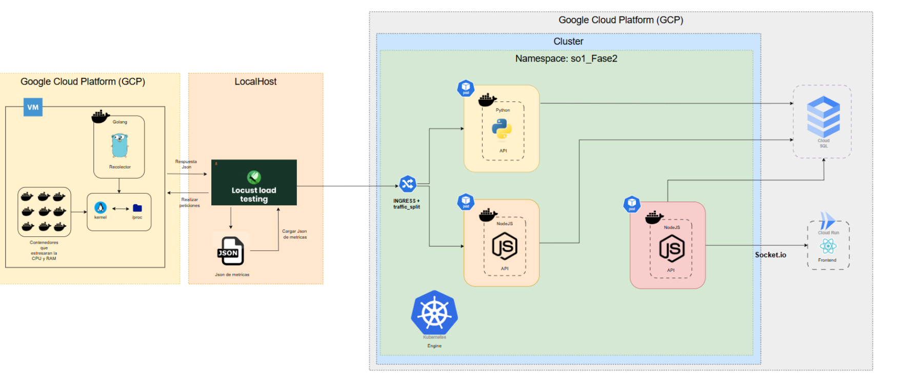
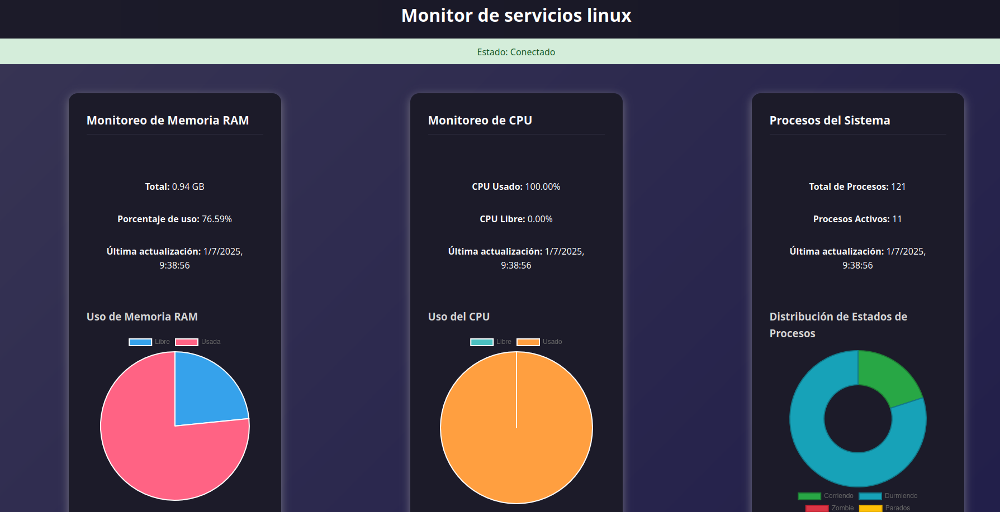

# Manual tecnico
---
### *Giovanni Saul Concoha Cax - 202100229*

---
Te ayudo a estructurar tu proyecto de manera clara y detallada. Vamos parte por parte:

## **PARTE 1: MÁQUINA VIRTUAL CON BACKEND COLLECTOR (GCP)**

### Función Principal:
Esta VM actúa como el **sistema objetivo** que será monitoreado y estresado durante las pruebas de carga.

### Componentes:
- **Máquina Virtual en GCP**: El servidor que queremos monitorear
- **Contenedor Docker**: Contiene la aplicación backend
- **Backend en Go**: Aplicación que lee las métricas del sistema
- **Módulos del Kernel**: 
  - Módulo CPU: Lee información de procesamiento
  - Módulo RAM: Lee información de memoria
  - Módulo Procesos: Lee estados de procesos (corriendo, durmiendo, zombie, parados)

### Flujo:
El backend de Go lee constantemente los archivos en `/proc` (que es donde Linux expone información del sistema) y a través de los módulos del kernel obtiene métricas como uso de CPU, RAM y estados de procesos. Esta información se expone mediante una API REST que responde con un JSON cuando recibe peticiones.

### Arquitectura

---

## **PARTE 2: GENERADOR DE TRÁFICO LOCAL (TU MÁQUINA)**

### Función Principal:
Simular usuarios reales haciendo peticiones al sistema para generar carga y recopilar datos de rendimiento.

### Cómo Funciona Locust:

**Primera Fase - Recolección de Datos:**
- Locust simula 300 usuarios virtuales
- Cada usuario hace peticiones HTTP a la VM (Parte 1) cada 1-2 segundos
- Cada petición obtiene un JSON con las métricas del sistema
- Durante 3 minutos se recopilan aproximadamente 2000 registros
- Todos estos JSONs se almacenan en un array local

**Segunda Fase - Generación de Tráfico:**
- Con los 2000 registros recopilados, Locust ahora simula 150 usuarios
- Estos usuarios envían los datos (no los solicitan) al sistema de Kubernetes
- Las peticiones van cada 1-4 segundos
- Cada petición envía uno de los JSONs recopilados al Ingress del cluster

### ¿Por qué dos fases?
1. **Recolectar**: Obtener datos reales del sistema bajo estrés
2. **Reproducir**: Usar esos datos para probar el sistema de procesamiento y almacenamiento

---

## **PARTE 3: CLUSTER KUBERNETES CON PROCESAMIENTO (GCP)**

### 3.1 INGRESS Y TRAFFIC SPLIT

**Función**: Punto de entrada y distribución de tráfico
- **Ingress**: Recibe todas las peticiones HTTP externas (desde Locust)
- **Traffic Split**: Divide el tráfico 50/50 entre dos rutas
- Actúa como un balanceador de carga inteligente

### 3.2 NAMESPACE: so1_fase2

**Función**: Contenedor lógico que agrupa todos los recursos relacionados
- Aísla los componentes del proyecto
- Facilita la gestión y organización

### 3.3 PODS Y CONTENEDORES

**¿Qué es un Pod?**
Un Pod es la unidad mínima de despliegue en Kubernetes. Contiene uno o más contenedores que comparten red y almacenamiento.

**Pod 1 - API Python:**
- Contenedor con aplicación Python
- Recibe 50% del tráfico del Ingress
- Procesa los JSONs recibidos
- Inserta datos en Cloud SQL

**Pod 2 - API NodeJS (Ruta 2):**
- Contenedor con aplicación NodeJS
- Recibe el otro 50% del tráfico
- Misma función que la API Python
- También inserta en Cloud SQL

**Pod 3 - API NodeJS con Socket.IO:**
- Contenedor con aplicación NodeJS
- Se conecta a Cloud SQL para consultar datos
- Expone WebSocket para comunicación en tiempo real
- Envía datos al frontend via Socket.IO

### 3.4 CLOUD SQL (FUERA DEL CLUSTER)

**Función**: Base de datos administrada por Google
- Almacena todas las métricas procesadas
- MySQL como motor de base de datos
- Escalable y administrada automáticamente
- Las tres APIs se conectan a esta base de datos

### 3.5 FRONTEND (FUERA DEL CLUSTER, EN CLOUD RUN)

**Función**: Interfaz de usuario para visualización
- Aplicación React desplegada en Cloud Run
- Se conecta via Socket.IO al Pod 3
- Muestra gráficas en tiempo real de CPU y RAM
- Muestra tabla con información de procesos

---

## **FLUJO COMPLETO DEL SISTEMA:**

1. **Locust** (local) → **VM** (GCP): Recolecta datos
2. **Locust** (local) → **Ingress** (Kubernetes): Envía datos
3. **Ingress** → **API Python/NodeJS** (50/50): Distribuye tráfico
4. **APIs** → **Cloud SQL**: Almacenan datos
5. **Frontend** ↔ **API Socket.IO** ↔ **Cloud SQL**: Visualización en tiempo real

## **Dashboar**



## kubernetes
Claro, Giovanni. Aquí tienes una documentación completa y estructurada sobre Kubernetes en formato Markdown, ideal para incluir en un repositorio técnico o como guía de referencia personal:

---

## 1. ¿Qué es Kubernetes?

Kubernetes es un sistema de orquestación de contenedores de código abierto que permite automatizar el despliegue, escalamiento y gestión de aplicaciones en contenedores.

---

## 2. Componentes principales

| Componente | Descripción |
|------------|-------------|
| Pod        | Unidad mínima que se puede desplegar. Contiene uno o más contenedores. |
| Nodo       | Máquina virtual o física que ejecuta Pods. |
| Clúster    | Conjunto de nodos gestionados como una sola unidad lógica. |
| Namespace  | Espacio lógico para aislar recursos dentro del clúster. |
| Deployment | Controlador que gestiona réplicas, actualizaciones y reinicios de Pods. |
| Service    | Abstracción de red para exponer aplicaciones. Puede ser interno o externo. |
| ConfigMap  | Almacén para variables de configuración no sensibles. |
| Secret     | Almacén para datos sensibles como contraseñas o tokens. |
| Ingress    | Controlador para enrutar tráfico HTTP/HTTPS a los servicios internos. |

---

## 3. Organización de manifiestos

```
kubernetes/
├── namespace.yaml
├── deployments/
│   ├── python-api-deployment.yaml
│   └── nodejs-api-deployment.yaml
├── services/
│   ├── python-api-service.yaml
│   └── nodejs-api-service.yaml
├── configmaps/
│   └── database-config.yaml
├── secrets/
│   └── database-secret.yaml
└── ingress/
    └── traffic-split-ingress.yaml
```

---

## 4. Ejemplos de recursos

### 4.1 Namespace

```yaml
apiVersion: v1
kind: Namespace
metadata:
  name: dev
```

---

### 4.2 Deployment

```yaml
apiVersion: apps/v1
kind: Deployment
metadata:
  name: python-api
spec:
  replicas: 2
  selector:
    matchLabels:
      app: python-api
  template:
    metadata:
      labels:
        app: python-api
    spec:
      containers:
        - name: python-api
          image: gcr.io/mi-proyecto/python-api:latest
          ports:
            - containerPort: 5000
```

---

### 4.3 Service

```yaml
apiVersion: v1
kind: Service
metadata:
  name: python-api-service
spec:
  selector:
    app: python-api
  ports:
    - port: 80
      targetPort: 5000
  type: ClusterIP
```

---

### 4.4 ConfigMap

```yaml
apiVersion: v1
kind: ConfigMap
metadata:
  name: database-config
data:
  DB_HOST: 10.0.0.10
  DB_PORT: "5432"
```

---

### 4.5 Secret

```yaml
apiVersion: v1
kind: Secret
metadata:
  name: database-secret
type: Opaque
data:
  DB_PASSWORD: bXlzZWNyZXRwYXNzd29yZA==
```

Nota: Los valores están en base64.

---

### 4.6 Ingress

```yaml
apiVersion: networking.k8s.io/v1
kind: Ingress
metadata:
  name: traffic-split-ingress
spec:
  rules:
    - host: api.midominio.com
      http:
        paths:
          - path: /python
            pathType: Prefix
            backend:
              service:
                name: python-api-service
                port:
                  number: 80
          - path: /node
            pathType: Prefix
            backend:
              service:
                name: nodejs-api-service
                port:
                  number: 80
```

---

## 5. Conectividad con Cloud SQL (GCP)

- Usar el Cloud SQL Auth Proxy como contenedor sidecar.
- Asegurar acceso VPC (privado o público con IP permitida).
- Configurar credenciales vía Secrets y variables de entorno.

---

## 6. Comandos útiles

# Obtener credenciales del clúster
gcloud container clusters get-credentials sopes1f2 --zone=us-central1-f

# Ver nodos activos
kubectl get nodes

# Ver Pods en un namespace
kubectl get pods -n dev

# Crear recursos desde YAML
kubectl apply -f kubernetes/ --recursive

